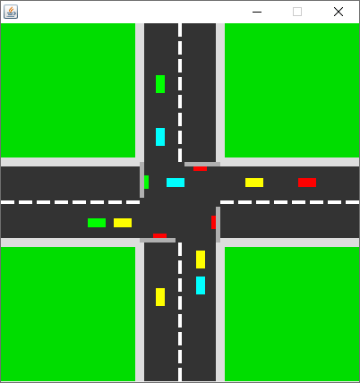
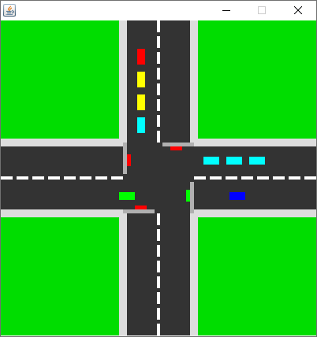

## Projeto Semáforo
O projeto semáforo é um simples simulador de um cruzamento de ruas, onde existe um semáforo em cada rua.

 

##### Threads!
O sistema é dividido em três principais partes:
- Interface do Usuário (classe Desenho) → Responsável por desenhar os dados na tela. Esta classe utiliza uma Thread para atualizar o desenho.
- Semáforos (classe Semaforo) → Responsável por transitar entre estados e avisar aos carros as alterações. Esta classe utiliza uma Thread para gerenciar a troca de estados.
- Carros (classe Carro) → Objeto a ter o comportamento observado. Cada carro possui uma Thread própria, que entra em estado de espera caso atinja um semáforo vermelho e sai deste estado quando o semáforo abre.

#### Requisitos
* Java 1.8
* Java Swing
